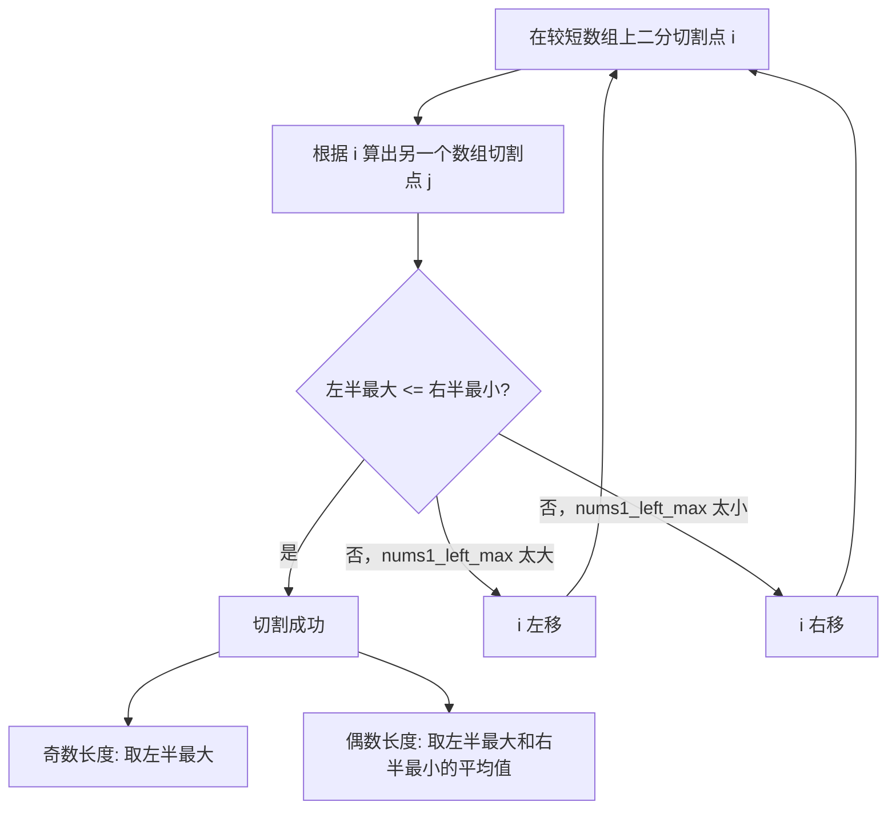

# Hot100 回溯与二分查找题解

只整理 LeetCode Hot 100 里属于 `回溯` 和 `二分查找` 的题。

目标：

- 尽量简单，方便记忆
- 代码默认用 Python
- 注释按 Python 小白能看懂来写
- 能用简单版讲清楚的题，不强行上复杂写法
- 如果“简单版”和“更优版”差别明显，会写两个版本
- 每题补一个图解，优先用 `ASCII`，少数题补 `Mermaid`

***

## 一、先记住两个专题的总套路

### 1. 回溯总套路

回溯就是：

1. 先做一个选择
2. 继续往下试
3. 试完回来，把刚才的选择撤销

最常见的变量：

- `path`：当前已经选了什么
- `res`：最终答案
- `start`：从哪里开始选，常用于组合 / 子集
- `used`：哪些元素已经用过，常用于排列

回溯口诀：

`做选择 -> 递归 -> 撤销选择`

图解：

```text
开始
  |
选一个
  |
继续往下选
  |
走到底得到答案
  |
退回来，撤销刚才那一步
  |
换一个新选择继续试
```

***

### 2. 二分查找总套路

二分查找适用于：

- 数组有序
- 或者虽然不是直接有序，但能根据 `mid` 判断答案在左边还是右边

最常见写法：

```python
left, right = 0, len(nums) - 1

while left <= right:
    mid = left + (right - left) // 2

    if nums[mid] == target:
        return mid
    elif nums[mid] < target:
        left = mid + 1
    else:
        right = mid - 1
```

二分口诀：

`看中间，砍一半`

补充背景知识：

- `//` 是整除，`7 // 2 == 3`
- `mid = left + (right - left) // 2` 比 `(left + right) // 2` 更规范
- `left <= right` 表示区间是闭区间 `[left, right]`

二分前置知识：什么时候该想到它

- 数据本身有序
- 或者题目虽然没直接给有序数组，但答案满足“左边一整段都不行 / 都行，右边另一整段相反”这种单调性

你可以把二分想成“每次问一个中间问题，然后排除一半”。

常见适用场景：

- 在有序数组里找某个数
- 找第一个满足条件的位置
- 找最后一个满足条件的位置
- 在旋转数组、答案区间里继续利用局部有序或单调性

要特别注意：

- 先想清楚这题到底在找“值”，还是在找“边界”
- 循环里必须保证区间真的缩小，否则容易死循环
- `mid` 满足条件时，答案不一定就是它，有时还要继续往左或往右找边界

图解：

```text
有序数组: [1, 3, 5, 7, 9, 11, 13]

left                     right
  |                        |
  v                        v
[1, 3, 5, 7, 9, 11, 13]
          ^
         mid

如果 target < nums[mid]，去左半边
如果 target > nums[mid]，去右半边
每次都砍掉一半
```

***

## 二、回溯专题

### 回溯预备课

如果你是第一次接触回溯，建议先把这一段看完，再去做后面的 8 道题。

很多人一开始会觉得回溯“很玄”，其实它没有那么神秘。

你可以先把回溯想成：

`一边试路，一边撤回，再换路继续试`

它特别像：

- 走迷宫
- 排组合
- 枚举所有可能答案

只不过它不是傻试到底，而是：

`能提前判断不可能的路，就早点停掉`

这就是大家常说的：

`回溯 = 穷举 + 剪枝`

***

### 1. 什么是回溯算法

回溯最核心的 3 个动作是：

1. `选择`
   在当前状态下，你可以做哪些选择
2. `递归`
   做出一个选择，进入下一层继续试
3. `撤销选择`
   这一条路试完后，退回上一层，再试别的路

比如你要从 `[1,2,3]` 里选数：

- 先选 `1`
- 再往下选
- 发现这条路走完了
- 就退回来
- 改成先选 `2`

所以回溯的本质不是“神奇技巧”，而是：

`系统地试完所有可能路径`

***

### 2. 回溯通用模板

先看最经典模板：

```python
def backtrack(路径, 选择列表):
    if 满足结束条件:
        结果集.append(路径的拷贝)
        return

    for 选择 in 选择列表:
        做选择
        backtrack(新的状态)
        撤销选择
```

如果换成更贴近 Python 真代码的写法，可以理解成：

```python
def backtrack(path):
    if 结束条件成立:
        res.append(path[:])   # 注意要拷贝
        return

    for 选择 in 当前可选项:
        path.append(选择)     # 做选择
        backtrack(path)       # 递归进入下一层
        path.pop()            # 撤销选择
```

这里最重要的一句是：

`append 是做选择，pop 是撤销选择`

如果你只会 `append`，不会 `pop`，那就不是回溯，而是一路冲下去回不来了。

***

### 3. 回溯 vs 递归

很多小白会把“回溯”和“递归”当成一回事。

它们有关系，但不完全一样。

你可以先这样理解：

- `递归` 是一种写函数的方法
- `回溯` 是一种“用递归来穷举所有可能答案”的解题思路

区别可以记成：

| 项目      | 递归        | 回溯          |
| ------- | --------- | ----------- |
| 目的      | 把大问题拆成小问题 | 试出所有可能解     |
| 是否要撤销状态 | 通常不强调     | 必须撤销        |
| 结果数量    | 常常一个结果    | 常常多个结果      |
| 直观比喻    | 一层层拆问题    | 走迷宫，走不通就退回来 |

一句话记忆：

`回溯几乎总是递归写的，但递归不一定是回溯`

***

### 4. 子集树 vs 排列树

这是回溯入门最重要的一个区别。

很多题不会做，不是不会回溯，而是没分清：

- 这题是“子集型”
- 还是“排列型”

#### 4.1 子集树

子集题的特点是：

- 每个元素可以选，也可以不选
- 顺序不重要

比如 `[1,2,3]` 的子集有：

- `[]`
- `[1]`
- `[2]`
- `[3]`
- `[1,2]`
- `[1,3]`
- `[2,3]`
- `[1,2,3]`

最常见写法是：

```python
def subsets(nums):
    result = []

    def backtrack(start, path):
        # 每到一个节点，当前 path 都是一个合法子集
        result.append(path[:])

        for i in range(start, len(nums)):
            path.append(nums[i])
            backtrack(i + 1, path)   # 下一层只能从后面继续选
            path.pop()

    backtrack(0, [])
    return result
```

这里最关键的是：

`用 start 控制从哪里开始选`

因为子集不关心顺序，所以不能回头乱选，不然会重复。

#### 4.2 排列树

排列题的特点是：

- 每个元素都要参与
- 顺序很重要

比如 `[1,2,3]` 的排列有：

- `[1,2,3]`
- `[1,3,2]`
- `[2,1,3]`
- `[2,3,1]`
- `[3,1,2]`
- `[3,2,1]`

最常见写法是：

```python
def permute(nums):
    result = []

    def backtrack(path, used):
        if len(path) == len(nums):
            result.append(path[:])
            return

        for i in range(len(nums)):
            if used[i]:
                continue

            used[i] = True
            path.append(nums[i])
            backtrack(path, used)
            path.pop()
            used[i] = False

    backtrack([], [False] * len(nums))
    return result
```

这里最关键的是：

`用 used 记录这个元素当前路径里有没有被用过`

所以你可以把两类题先粗暴地区分成：

- `子集 / 组合`：常用 `start`
- `排列`：常用 `used`

***

### 5. 剪枝是什么

剪枝就是：

`发现这条路一定不可能成功，就提前停掉，不再继续试`

它的作用是：

- 少走没必要的分支
- 提高速度

比如 `组合总和` 里，如果你已经知道当前和超过 `target` 了，那这条路后面就不用试了。

```python
for i in range(start, len(nums)):
    if sum(path) + nums[i] > target:
        break

    path.append(nums[i])
    backtrack(i, path)
    path.pop()
```

这就是剪枝。

一句话记忆：

`剪枝不是换答案，而是少走废路`

***

### 6. 决策树图示

以 `[1,2,3]` 的子集为例，可以把回溯过程想成下面这棵树：

```text
              []
           /   |   \
         [1]  [2]  [3]
        /  \   |
    [1,2] [1,3] [2,3]
      /
 [1,2,3]
```

更准确地说，程序在做的事就是：

- 站在一个节点
- 把当前路径记下来
- 再尝试往下走到子节点
- 子节点走完，退回来
- 换另一条边继续走

所以回溯不是死记代码，而是：

`脑子里先有树，代码只是沿着树去走`

***

### 7. 本专题刷题顺序

如果你想按最容易入门的顺序来，建议这样刷：

1. `78 子集`
2. `46 全排列`
3. `39 组合总和`
4. `22 括号生成`
5. `17 电话号码的字母组合`
6. `131 分割回文串`
7. `79 单词搜索`
8. `51 N 皇后`

原因很简单：

- `子集 / 全排列` 最适合建立回溯基本感觉
- `组合总和 / 括号生成 / 电话号码字母组合` 用来练“路径 + 约束”
- `分割回文串 / 单词搜索` 开始出现“切割”和“棋盘搜索”
- `N 皇后` 是综合难题，放最后最合适

***

Hot 100 回溯题共 8 题：

- <br />

***

## 46. 全排列

### 题目

原题：[46. 全排列](https://leetcode.cn/problems/permutations/)

给定一个不含重复数字的数组 nums ，返回其 所有可能的全排列 。你可以 按任意顺序 返回答案。

示例 1：

输入：nums = \[1,2,3]
输出：\[\[1,2,3],\[1,3,2],\[2,1,3],\[2,3,1],\[3,1,2],\[3,2,1]]

示例 2：

输入：nums = \[0,1]
输出：\[\[0,1],\[1,0]]

示例 3：

输入：nums = \[1]
输出：\[\[1]]

提示：

- 1 <= nums.length <= 6
- -10 <= nums\[i] <= 10
- nums 中的所有整数 互不相同

### 思路

排列的特点是：

- 每个数字都要考虑放进去
- 但一个数字在同一条路径里不能重复使用

所以需要一个 `used` 数组记录哪些数字已经用过。

### 图解

以 `nums = [1, 2, 3]` 为例：

```text
[]
├─ [1]
│  ├─ [1,2]
│  │  └─ [1,2,3]
│  └─ [1,3]
│     └─ [1,3,2]
├─ [2]
│  ├─ [2,1]
│  │  └─ [2,1,3]
│  └─ [2,3]
│     └─ [2,3,1]
└─ [3]
   ├─ [3,1]
   │  └─ [3,1,2]
   └─ [3,2]
      └─ [3,2,1]
```

### 口诀

`排列看 used，选过不能再选`

### 背景知识

- `len(path)` 表示当前已经选了几个数
- 当 `len(path) == len(nums)`，说明一个完整排列已经组成了
- `path[:]` 表示复制列表。如果直接 `append(path)`，后面 `path` 改了，答案也会跟着变

### Python

```python
class Solution:
    def permute(self, nums):
        res = []
        path = []
        used = [False] * len(nums)  # 每个位置是否已经被使用

        def dfs():
            # 如果当前路径长度已经和 nums 一样长，说明得到一个完整排列
            if len(path) == len(nums):
                res.append(path[:])  # 一定要复制一份
                return

            # 尝试把每个还没用过的数字放到当前位置
            for i in range(len(nums)):
                if used[i]:
                    continue

                path.append(nums[i])   # 做选择
                used[i] = True

                dfs()                  # 递归进入下一层

                used[i] = False        # 撤销选择
                path.pop()

        dfs()
        return res
```

### 复杂度

- 时间复杂度：`O(n * n!)`
- 空间复杂度：`O(n)`

### 更优版

这题最常用的标准解就是上面这个版本，已经足够好了，也最容易记。

***

## 78. 子集

### 题目

原题：[78. 子集](https://leetcode.cn/problems/subsets/)

给你一个整数数组 nums ，数组中的元素 互不相同 。返回该数组所有可能的子集（幂集）。

解集 不能 包含重复的子集。你可以按 任意顺序 返回解集。

示例 1：

输入：nums = \[1,2,3]
输出：\[\[],\[1],\[2],\[1,2],\[3],\[1,3],\[2,3],\[1,2,3]]

示例 2：

输入：nums = \[0]
输出：\[\[],\[0]]

提示：

- 1 <= nums.length <= 10
- -10 <= nums\[i] <= 10
- nums 中的所有元素 互不相同

### 思路

子集问题的本质是：

- 每个数都可以选
- 也可以不选

为了避免重复，通常用 `start` 控制下一层从后面开始选。

### 图解

以 `nums = [1, 2, 3]` 为例：

```text
[]
├─ 选 1 -> [1]
│  ├─ 选 2 -> [1,2]
│  │  └─ 选 3 -> [1,2,3]
│  └─ 选 3 -> [1,3]
├─ 选 2 -> [2]
│  └─ 选 3 -> [2,3]
└─ 选 3 -> [3]

别忘了：
每到一个节点，当前 path 本身就是一个答案
所以答案有：
[], [1], [1,2], [1,2,3], [1,3], [2], [2,3], [3]
```

### 口诀

`子集先收集答案，再往后选`

### 背景知识

- 子集题和排列题不同，子集不关心顺序
- 所以 `[1,2]` 和 `[2,1]` 算同一个子集
- 因此不能从头随便选，要从 `start` 往后选

### Python

```python
class Solution:
    def subsets(self, nums):
        res = []
        path = []

        def dfs(start):
            # 每到一个位置，当前 path 都是一个合法子集
            res.append(path[:])

            # 从 start 开始往后选，避免重复
            for i in range(start, len(nums)):
                path.append(nums[i])   # 做选择
                dfs(i + 1)             # 下一层只能选后面的数
                path.pop()             # 撤销选择

        dfs(0)
        return res
```

### 复杂度

- 时间复杂度：`O(n * 2^n)`
- 空间复杂度：`O(n)`

### 更优版

这题标准回溯已经很简洁。也可以用“迭代扩展子集”的方法，但不如回溯好记。

***

## 17. 电话号码的字母组合

### 题目

原题：[17. 电话号码的字母组合](https://leetcode.cn/problems/letter-combinations-of-a-phone-number/)

给定一个仅包含数字 2-9 的字符串，返回所有它能表示的字母组合。答案可以按 任意顺序 返回。

给出数字到字母的映射如下（与电话按键相同）。注意 1 不对应任何字母。

示例 1：

输入：digits = "23"
输出：\["ad","ae","af","bd","be","bf","cd","ce","cf"]

示例 2：

输入：digits = "2"
输出：\["a","b","c"]

提示：

- 1 <= digits.length <= 4
- digits\[i] 是范围 \['2', '9'] 的一个数字。

### 思路

每个数字对应若干字母：

- `2 -> abc`
- `3 -> def`

题目本质是：

- 第 1 位从第 1 组字母里选一个
- 第 2 位从第 2 组字母里选一个
- 一直选到末尾

### 图解

以 `digits = "23"` 为例：

```text
第 1 位: 2 -> abc
第 2 位: 3 -> def

            ""
        /    |    \
       a     b     c
     / | \ / | \ / | \
    d  e  f d  e  f d  e  f

答案:
ad ae af bd be bf cd ce cf
```

### 口诀

`一位一位填字母，填满就是答案`

### 背景知识

- 字符串也能遍历，比如 `for ch in "abc":`
- `''.join(path)` 表示把列表里的字符拼成字符串
- 空字符串输入时要直接返回 `[]`

### Python

```python
class Solution:
    def letterCombinations(self, digits):
        if not digits:
            return []

        mapping = {
            "2": "abc", "3": "def", "4": "ghi", "5": "jkl",
            "6": "mno", "7": "pqrs", "8": "tuv", "9": "wxyz"
        }

        res = []
        path = []

        def dfs(index):
            # index 表示现在要处理 digits 的第几位
            if index == len(digits):
                res.append("".join(path))
                return

            letters = mapping[digits[index]]

            for ch in letters:
                path.append(ch)        # 选择当前字母
                dfs(index + 1)         # 处理下一位数字
                path.pop()             # 撤销选择

        dfs(0)
        return res
```

### 复杂度

- 时间复杂度：`O(4^n * n)`
- 空间复杂度：`O(n)`

### 更优版

这题回溯标准写法已经很好，没必要为了“更优”牺牲记忆成本。

***

## 39. 组合总和

### 题目

原题：[39. 组合总和](https://leetcode.cn/problems/combination-sum/)

给你一个 无重复元素 的整数数组 candidates 和一个目标整数 target ，找出 candidates 中可以使数字和为目标数 target 的 所有 不同组合 ，并以列表形式返回。你可以按 任意顺序 返回这些组合。

candidates 中的 同一个 数字可以 无限制重复被选取 。如果至少一个数字的被选数量不同，则两种组合是不同的。

对于给定的输入，保证和为 target 的不同组合数少于 150 个。

示例 1：

输入：candidates = \[2,3,6,7], target = 7
输出：\[\[2,2,3],\[7]]
解释：
2 和 3 可以形成一组候选，2 + 2 + 3 = 7 。注意 2 可以使用多次。
7 也是一个候选， 7 = 7 。
仅有这两种组合。

示例 2：

输入: candidates = \[2,3,5], target = 8
输出: \[\[2,2,2,2],\[2,3,3],\[3,5]]

示例 3：

输入: candidates = \[2], target = 1
输出: \[]

提示：

- 1 <= candidates.length <= 30
- 2 <= candidates\[i] <= 40
- candidates 的所有元素 互不相同
- 1 <= target <= 40

### 思路

题目给的是“可以重复选同一个数”。

所以当我们选了 `candidates[i]` 以后：

- 下一层还可以继续选 `i`
- 而不是只能从 `i + 1` 开始

另外，当前和如果已经大于目标值，就没必要继续搜了。

### 图解

以 `candidates = [2,3,6,7], target = 7` 为例：

```text
remain = 7, path = []
├─ 选 2 -> remain = 5, path = [2]
│  ├─ 再选 2 -> remain = 3, path = [2,2]
│  │  ├─ 再选 2 -> remain = 1, path = [2,2,2]  不行，后面更大，停
│  │  └─ 选 3 -> remain = 0, path = [2,2,3]    成功
│  └─ 选 3 -> remain = 2, path = [2,3]         不够，后面更大，停
├─ 选 3 -> remain = 4, path = [3]
│  └─ 再选 3 -> remain = 1, path = [3,3]       不行
├─ 选 6 -> remain = 1                           不行
└─ 选 7 -> remain = 0, path = [7]              成功
```

### 口诀

`组合看 start，可重复就继续传 i`

### 背景知识

- 排序以后更容易剪枝
- “剪枝”就是提前结束没必要的搜索
- `remain` 表示还差多少到目标值

### Python

```python
class Solution:
    def combinationSum(self, candidates, target):
        candidates.sort()  # 先排序，方便剪枝
        res = []
        path = []

        def dfs(start, remain):
            # remain == 0，说明刚好凑出 target
            if remain == 0:
                res.append(path[:])
                return

            for i in range(start, len(candidates)):
                num = candidates[i]

                # 因为已经排序，后面的数只会更大，直接结束
                if num > remain:
                    break

                path.append(num)
                dfs(i, remain - num)  # 可以重复选自己，所以传 i
                path.pop()

        dfs(0, target)
        return res
```

### 复杂度

- 时间复杂度：指数级，通常写作 `O(S)`，本质上取决于搜索树大小
- 空间复杂度：递归深度最坏约 `O(target / min(candidates))`

### 更优版

排序加剪枝就是这题最实用、最容易记的版本。

***

## 22. 括号生成

### 题目

原题：[22. 括号生成](https://leetcode.cn/problems/generate-parentheses/)

数字 n 代表生成括号的对数，请你设计一个函数，用于能够生成所有可能的并且 有效的 括号组合。

示例 1：

输入：n = 3
输出：\["((()))","(()())","(())()","()(())","()()()"]

示例 2：

输入：n = 1
输出：\["()"]

提示：

- 1 <= n <= 8

### 思路

放括号时要遵守两个规则：

1. 左括号数量不能超过 `n`
2. 右括号数量不能超过左括号数量

只要一直保证合法，最后长度到 `2 * n` 就是答案。

### 图解

以 `n = 3` 为例：

```text
""  (left=0, right=0)
└─ "("
   ├─ "(("
   │  ├─ "((("
   │  │  └─ "((()))"
   │  └─ "(()"
   │     ├─ "(()("
   │     │  └─ "(()())"
   │     └─ "(())"
   │        └─ "(())()"
   └─ "()"
      └─ "()("
         ├─ "()(("
         │  └─ "()(())"
         └─ "()()"
            └─ "()()()"
```

### 口诀

`左括号随便放，右括号不能抢跑`

### 背景知识

- `left` 表示已经放了几个 `(`
- `right` 表示已经放了几个 `)`
- 如果 `right > left`，括号一定非法

### Python

```python
class Solution:
    def generateParenthesis(self, n):
        res = []
        path = []

        def dfs(left, right):
            # 如果长度够了，说明组成了一个合法括号串
            if len(path) == 2 * n:
                res.append("".join(path))
                return

            # 只要左括号还没用完，就可以继续放
            if left < n:
                path.append("(")
                dfs(left + 1, right)
                path.pop()

            # 右括号数量必须小于左括号数量，才能放
            if right < left:
                path.append(")")
                dfs(left, right + 1)
                path.pop()

        dfs(0, 0)
        return res
```

### 复杂度

- 时间复杂度：与卡特兰数相关，通常记作 `O(Cn)`
- 空间复杂度：`O(n)`

### 更优版

这题标准回溯就是最佳记忆版本。

***

## 79. 单词搜索

### 题目

原题：[79. 单词搜索](https://leetcode.cn/problems/word-search/)

给定一个 m x n 二维字符网格 board 和一个字符串单词 word 。如果 word 存在于网格中，返回 true ；否则，返回 false 。

单词必须按照字母顺序，通过相邻的单元格内的字母构成，其中“相邻”单元格是那些水平相邻或垂直相邻的单元格。同一个单元格内的字母不允许被重复使用。

示例 1：

输入：board = \[\['A','B','C','E'],\['S','F','C','S'],\['A','D','E','E']], word = "ABCCED"
输出：true

示例 2：

输入：board = \[\['A','B','C','E'],\['S','F','C','S'],\['A','D','E','E']], word = "SEE"
输出：true

示例 3：

输入：board = \[\['A','B','C','E'],\['S','F','C','S'],\['A','D','E','E']], word = "ABCB"
输出：false

提示：

- m == board.length
- n = board\[i].length
- 1 <= m, n <= 6
- 1 <= word.length <= 15
- board 和 word 仅由大小写英文字母组成

进阶：你可以使用搜索剪枝的技术来优化解决方案，使其在 board 更大的情况下可以更快解决问题？

### 思路

从棋盘每个位置出发做 DFS：

- 当前字符对上了，继续搜上下左右
- 当前字符对不上，直接返回 `False`
- 一个格子在同一条路径里不能重复使用

最省事的做法是：

- 暂时把访问过的位置改成特殊字符
- 搜完再改回来

### 图解

以 `word = "ABCCED"` 为例：

```text
棋盘:
A B C E
S F C S
A D E E

一条成功路径可能是:
(0,0) A
  -> (0,1) B
      -> (0,2) C
          -> (1,2) C
              -> (2,2) E
                  -> (2,1) D

走过的格子本轮不能再走
所以每进一格，都要先标记
回退时再恢复
```

### 口诀

`先匹配，再四连搜，走过要标记，回来要恢复`

### 背景知识

- 二维数组访问：`board[row][col]`
- 越界判断：
  `row < 0 or row >= rows or col < 0 or col >= cols`
- 这题的 DFS 返回值是 `True / False`

### Python

```python
class Solution:
    def exist(self, board, word):
        rows = len(board)
        cols = len(board[0])

        def dfs(r, c, index):
            # index 表示当前要匹配 word[index]
            if index == len(word):
                return True

            # 越界，直接失败
            if r < 0 or r >= rows or c < 0 or c >= cols:
                return False

            # 字符不匹配，直接失败
            if board[r][c] != word[index]:
                return False

            # 先保存原字符，再做访问标记
            temp = board[r][c]
            board[r][c] = "#"

            found = (
                dfs(r + 1, c, index + 1) or
                dfs(r - 1, c, index + 1) or
                dfs(r, c + 1, index + 1) or
                dfs(r, c - 1, index + 1)
            )

            # 回溯：恢复现场
            board[r][c] = temp
            return found

        for r in range(rows):
            for c in range(cols):
                if dfs(r, c, 0):
                    return True

        return False
```

### 复杂度

- 时间复杂度：最坏 `O(m * n * 4^L)`
- 空间复杂度：`O(L)`

这里：

- `m, n` 是棋盘行列数
- `L` 是单词长度

### 更优版

这个版本已经是最常见写法。还能做字符频次剪枝，但记忆成本更高。

***

## 131. 分割回文串

### 题目

原题：[131. 分割回文串](https://leetcode.cn/problems/palindrome-partitioning/)

给你一个字符串 s，请你将 s 分割成一些 子串，使每个子串都是 回文串 。返回 s 所有可能的分割方案。

示例 1：

输入：s = "aab"
输出：\[\["a","a","b"],\["aa","b"]]

示例 2：

输入：s = "a"
输出：\[\["a"]]

提示：

- 1 <= s.length <= 16
- s 仅由小写英文字母组成

### 思路

这题是“切割型回溯”：

- 从当前位置开始
- 枚举切到哪里
- 如果切出来的这一段是回文串，就继续递归

### 图解

以 `s = "aab"` 为例：

```text
"aab"
├─ 切 "a"   (是回文)
│  剩下 "ab"
│  ├─ 切 "a"   (是回文)
│  │  剩下 "b"
│  │  └─ 切 "b"   -> ["a", "a", "b"]
│  └─ 切 "ab"  (不是回文，跳过)
├─ 切 "aa"  (是回文)
│  剩下 "b"
│  └─ 切 "b"   -> ["aa", "b"]
└─ 切 "aab" (不是回文，跳过)
```

### 口诀

`从左往右切，切出来先判断是不是回文`

### 背景知识

- `s[start:end + 1]` 表示取字符串的一段，左闭右闭靠写法补 `+1`
- 回文串就是正着读和倒着读一样
- `t[::-1]` 表示把字符串反过来

### Python

```python
class Solution:
    def partition(self, s):
        res = []
        path = []

        def is_palindrome(sub):
            # 判断一个字符串是否是回文串
            return sub == sub[::-1]

        def dfs(start):
            # start 走到末尾，说明已经完成一种切分
            if start == len(s):
                res.append(path[:])
                return

            # 枚举下一刀切在哪里
            for end in range(start, len(s)):
                sub = s[start:end + 1]

                if not is_palindrome(sub):
                    continue

                path.append(sub)
                dfs(end + 1)
                path.pop()

        dfs(0)
        return res
```

### 复杂度

- 时间复杂度：最坏指数级
- 空间复杂度：`O(n)`

### 更优版

可以先用动态规划预处理“哪些区间是回文”，这样每次不用重复判断。
但对背题来说，上面的写法更好记。

***

## 51. N 皇后

### 题目

原题：[51. N 皇后](https://leetcode.cn/problems/n-queens/)

按照国际象棋的规则，皇后可以攻击与之处在同一行或同一列或同一斜线上的棋子。

n 皇后问题 研究的是如何将 n 个皇后放置在 n×n 的棋盘上，并且使皇后彼此之间不能相互攻击。

给你一个整数 n ，返回所有不同的 n 皇后问题 的解决方案。

每一种解法包含一个不同的 n 皇后问题 的棋子放置方案，该方案中 'Q' 和 '.' 分别代表了皇后和空位。

示例 1：

输入：n = 4
输出：\[\[".Q..","...Q","Q...","..Q."],\["..Q.","Q...","...Q",".Q.."]]
解释：如上图所示，4 皇后问题存在两个不同的解法。

示例 2：

输入：n = 1
输出：\[\["Q"]]

提示：

- 1 <= n <= 9

### 思路

一行只放一个皇后，所以按“行”递归最自然。

每一行尝试每一列，但要满足：

- 同列不能有皇后
- 左上到右下的对角线不能有皇后
- 右上到左下的对角线不能有皇后

### 图解

以 `n = 4` 为例，下面是一个合法解：

```text
. Q . .
. . . Q
Q . . .
. . Q .
```

为什么 `(row, col)` 不能乱放？

```text
假设在 (1, 2) 放一个 Q

同列不能再放:
(_, 2)

左上右下对角线不能再放:
(0,1), (2,3), ...

右上左下对角线不能再放:
(0,3), (2,1), (3,0), ...
```

### 口诀

`一行放一个，列和两条斜线都不能撞`

### 背景知识

判断对角线常用两个值：

- 主对角线：`row - col`
- 副对角线：`row + col`

用 `set()` 存这些值，查找会很快。

### Python

```python
class Solution:
    def solveNQueens(self, n):
        res = []

        # 先造一个空棋盘
        board = [["."] * n for _ in range(n)]

        cols = set()      # 哪些列已经有皇后
        diag1 = set()     # 主对角线: row - col
        diag2 = set()     # 副对角线: row + col

        def dfs(row):
            # 如果 row == n，说明前 n 行都放好了
            if row == n:
                # 把二维字符数组转成题目要求的字符串列表
                res.append(["".join(line) for line in board])
                return

            for col in range(n):
                if col in cols:
                    continue
                if (row - col) in diag1:
                    continue
                if (row + col) in diag2:
                    continue

                # 放皇后
                board[row][col] = "Q"
                cols.add(col)
                diag1.add(row - col)
                diag2.add(row + col)

                dfs(row + 1)

                # 回溯：撤销
                board[row][col] = "."
                cols.remove(col)
                diag1.remove(row - col)
                diag2.remove(row + col)

        dfs(0)
        return res
```

### 复杂度

- 时间复杂度：最坏接近 `O(n!)`
- 空间复杂度：`O(n)`

### 更优版

可以用位运算继续优化，但不适合入门记忆。

***

## 三、二分查找专题

Hot 100 二分查找题共 6 题：

- <br />

### 二分专题入门提醒

这一组题虽然都叫二分，但难点不完全一样：

- `35`、`34` 更像“在有序区间里找值 / 找边界”
- `74` 是把二维矩阵转成“整体有序”来查
- `33`、`153` 是在旋转数组里找哪一半还保持有序
- `4` 不是普通查找，而是用二分去找“正确分割线”

做题前先问自己：

- 这题的单调性在哪里
- 我每次比较完 `mid`，能安全删掉哪一半
- 我要的是某个值，还是某个边界位置

***

## 35. 搜索插入位置

### 题目

原题：[35. 搜索插入位置](https://leetcode.cn/problems/search-insert-position/)

给定一个排序数组和一个目标值，在数组中找到目标值，并返回其索引。如果目标值不存在于数组中，返回它将会被按顺序插入的位置。

请必须使用时间复杂度为 O(log n) 的算法。

示例 1:

输入: nums = \[1,3,5,6], target = 5
输出: 2

示例 2:

输入: nums = \[1,3,5,6], target = 2
输出: 1

示例 3:

输入: nums = \[1,3,5,6], target = 7
输出: 4

提示:

- 1 <= nums.length <= 104
- -104 <= nums\[i] <= 104
- nums 为 无重复元素 的 升序 排列数组
- -104 <= target <= 104

### 思路

这题就是最基础的二分查找：

- 找到就返回下标
- 找不到时，最后 `left` 停的位置就是该插入的位置

### 图解

以 `nums = [1,3,5,6], target = 2` 为例：

```text
开始：
nums = [1, 3, 5, 6]
target = 2

第 1 轮：
当前搜索区间是下标 [0, 3]
left = 0, right = 3
mid = (0 + 3) // 2 = 1
nums[mid] = nums[1] = 3

因为 3 > 2
说明 target 只能在左半边
所以把 right 改成 mid - 1 = 0

第 2 轮：
当前搜索区间是下标 [0, 0]
left = 0, right = 0
mid = (0 + 0) // 2 = 0
nums[mid] = nums[0] = 1

因为 1 < 2
说明 target 只能在右半边
所以把 left 改成 mid + 1 = 1

现在 left = 1, right = 0
循环结束

最后 left 停在 1
这就表示：
如果把 2 插进去，它应该放在下标 1
```

### 口诀

`找不到没关系，left 就是插入点`

### 背景知识

- 为什么最后返回 `left`？
  因为循环结束时，`left` 已经走到“第一个大于等于 target 的位置”

### Python

```python
class Solution:
    def searchInsert(self, nums, target):
        left, right = 0, len(nums) - 1

        while left <= right:
            mid = left + (right - left) // 2

            if nums[mid] == target:
                return mid
            elif nums[mid] < target:
                left = mid + 1
            else:
                right = mid - 1

        # 循环结束时，left 就是应该插入的位置
        return left
```

### 复杂度

- 时间复杂度：`O(log n)`
- 空间复杂度：`O(1)`

### 更优版

这题简单版就是最优版。

***

## 74. 搜索二维矩阵

### 题目

原题：[74. 搜索二维矩阵](https://leetcode.cn/problems/search-a-2d-matrix/)

给你一个满足下述两条属性的 m x n 整数矩阵：

- 每行中的整数从左到右按非严格递增顺序排列。
- 每行的第一个整数大于前一行的最后一个整数。

给你一个整数 target ，如果 target 在矩阵中，返回 true ；否则，返回 false 。

示例 1：

输入：matrix = \[\[1,3,5,7],\[10,11,16,20],\[23,30,34,60]], target = 3
输出：true

示例 2：

输入：matrix = \[\[1,3,5,7],\[10,11,16,20],\[23,30,34,60]], target = 13
输出：false

提示：

- m == matrix.length
- n == matrix\[i].length
- 1 <= m, n <= 100
- -104 <= matrix\[i]\[j], target <= 104

### 思路

矩阵虽然是二维，但题目有个关键性质：

- 每一行升序
- 下一行第一个数比上一行最后一个数大

这说明整个矩阵其实可以看成一个有序的一维数组。

### 图解

例如：

```text
matrix =
[
  [1,  3,  5,  7],
  [10, 11, 16, 20],
  [23, 30, 34, 60]
]

其实等价于一维有序数组：
[1, 3, 5, 7, 10, 11, 16, 20, 23, 30, 34, 60]

如果 mid = 6, cols = 4
row = 6 // 4 = 1
col = 6 % 4 = 2

也就是 matrix[1][2] = 16
```

如果想看“查找过程”也可以这样理解：

```text
把矩阵摊平后，相当于在这个数组里二分：

下标:  0  1  2  3   4   5   6   7   8   9   10  11
数值: [1, 3, 5, 7, 10, 11, 16, 20, 23, 30, 34, 60]

比如 target = 13

第 1 轮：
left = 0, right = 11
mid = 5
值 = 11
11 < 13，所以去右边

第 2 轮：
left = 6, right = 11
mid = 8
值 = 23
23 > 13，所以去左边

第 3 轮：
left = 6, right = 7
mid = 6
值 = 16
16 > 13，所以继续去左边

最后找不到，返回 False
```

### 口诀

`二维当一维，先找中间，再换坐标`

### 背景知识

- 一维下标转二维坐标：
  - 行号：`row = mid // cols`
  - 列号：`col = mid % cols`
- `%` 是取余数

### Python

```python
class Solution:
    def searchMatrix(self, matrix, target):
        rows = len(matrix)
        cols = len(matrix[0])

        left, right = 0, rows * cols - 1

        while left <= right:
            mid = left + (right - left) // 2

            row = mid // cols
            col = mid % cols
            value = matrix[row][col]

            if value == target:
                return True
            elif value < target:
                left = mid + 1
            else:
                right = mid - 1

        return False
```

### 复杂度

- 时间复杂度：`O(log(mn))`
- 空间复杂度：`O(1)`

### 更优版

这题简单版就是最优版。

***

## 34. 在排序数组中查找元素的第一个和最后一个位置

### 题目

原题：[34. 在排序数组中查找元素的第一个和最后一个位置](https://leetcode.cn/problems/find-first-and-last-position-of-element-in-sorted-array/)

给你一个按照非递减顺序排列的整数数组 nums，和一个目标值 target。请你找出给定目标值在数组中的开始位置和结束位置。

如果数组中不存在目标值 target，返回 \[-1, -1]。

你必须设计并实现时间复杂度为 O(log n) 的算法解决此问题。

示例 1：

输入：nums = \[5,7,7,8,8,10], target = 8
输出：\[3,4]

示例 2：

输入：nums = \[5,7,7,8,8,10], target = 6
输出：\[-1,-1]

示例 3：

输入：nums = \[], target = 0
输出：\[-1,-1]

提示：

- 0 <= nums.length <= 105
- -109 <= nums\[i] <= 109
- nums 是一个非递减数组
- -109 <= target <= 109

### 思路

关键点：

- 不是找“一个”位置
- 而是找“左边界”和“右边界”

最稳妥的方法是：

1. 二分找第一个 `>= target` 的位置
2. 二分找第一个 `> target` 的位置
3. 右边界就是第二个结果减 1

### 图解

以 `nums = [5,7,7,8,8,10], target = 8` 为例：

```text
下标:  0 1 2 3 4 5
数组: [5,7,7,8,8,10]

这题不是找“8 在不在”
而是找：
1. 最左边那个 8 在哪
2. 最右边那个 8 在哪

第 1 次二分：找第一个 >= 8 的位置

结果会停在下标 3
因为：
- 下标 0,1,2 的值都 < 8
- 下标 3 的值第一次达到 8

所以左边界 = 3

第 2 次二分：找第一个 > 8 的位置

结果会停在下标 5
因为：
- 下标 3,4 还是 8
- 到下标 5 时，值变成了 10，第一次 > 8

所以：
右边界 = 5 - 1 = 4

最终答案：
[3, 4]
```

### 口诀

`边界问题，二分两次`

### 背景知识

- 这类题本质是找“边界”
- 这种写法和 Python 里的 `bisect_left / bisect_right` 思想一致

### Python

```python
class Solution:
    def searchRange(self, nums, target):
        def lower_bound(nums, target):
            # 找第一个 >= target 的位置
            left, right = 0, len(nums)

            # 这里用左闭右开区间 [left, right)
            while left < right:
                mid = left + (right - left) // 2

                if nums[mid] < target:
                    left = mid + 1
                else:
                    right = mid

            return left

        left_index = lower_bound(nums, target)

        # 如果越界了，或者这个位置不是 target，说明根本不存在
        if left_index == len(nums) or nums[left_index] != target:
            return [-1, -1]

        right_index = lower_bound(nums, target + 1) - 1
        return [left_index, right_index]
```

### 复杂度

- 时间复杂度：`O(log n)`
- 空间复杂度：`O(1)`

### 更优版

这题上面这个版本已经是最常见的标准最优解。

***

## 33. 搜索旋转排序数组

### 题目

原题：[33. 搜索旋转排序数组](https://leetcode.cn/problems/search-in-rotated-sorted-array/)

整数数组 nums 按升序排列，数组中的值 互不相同 。

在传递给函数之前，nums 在预先未知的某个下标 k（0 <= k < nums.length）上进行了 向左旋转，使数组变为 \[nums\[k], nums\[k+1], ..., nums\[n-1], nums\[0], nums\[1], ..., nums\[k-1]]（下标 从 0 开始 计数）。例如， \[0,1,2,4,5,6,7] 下标 3 上向左旋转后可能变为 \[4,5,6,7,0,1,2] 。

给你 旋转后 的数组 nums 和一个整数 target ，如果 nums 中存在这个目标值 target ，则返回它的下标，否则返回 -1 。

你必须设计一个时间复杂度为 O(log n) 的算法解决此问题。

示例 1：

输入：nums = \[4,5,6,7,0,1,2], target = 0
输出：4

示例 2：

输入：nums = \[4,5,6,7,0,1,2], target = 3
输出：-1

示例 3：

输入：nums = \[1], target = 0
输出：-1

提示：

- 1 <= nums.length <= 5000
- -104 <= nums\[i] <= 104
- nums 中的每个值都 独一无二
- 题目数据保证 nums 在预先未知的某个下标上进行了旋转
- -104 <= target <= 104

### 思路

旋转后虽然整体不完全有序，但每次看 `mid` 时，至少有一半还是有序的。

因此每轮都做两件事：

1. 判断左半边有序还是右半边有序
2. 判断 `target` 在不在这个有序区间里

### 图解

以 `nums = [4,5,6,7,0,1,2], target = 0` 为例：

```text
nums = [4, 5, 6, 7, 0, 1, 2]
target = 0

第 1 轮：
left = 0, right = 6
mid = 3
nums[mid] = 7

先判断哪一半有序：
nums[left] = 4, nums[mid] = 7
因为 4 <= 7
说明左半边 [4,5,6,7] 是有序的

再看 target 在不在这段有序区间里：
0 不在 [4,7] 之间

所以答案只能在右半边
把 left 改成 mid + 1 = 4

第 2 轮：
left = 4, right = 6
mid = 5
nums[mid] = 1

nums[left] = 0, nums[mid] = 1
因为 0 <= 1
说明左半边 [0,1] 是有序的

这次 target = 0 在 [0,1] 之间
所以答案在左半边
把 right 改成 mid - 1 = 4

第 3 轮：
left = 4, right = 4
mid = 4
nums[mid] = 0

找到了，答案是下标 4
```

### 口诀

`先看哪边有序，再看目标在哪边`

### 背景知识

- “旋转数组”就是原本有序，某个位置断开后接到前面
- 例如：`[4,5,6,7,0,1,2]`

### Python

```python
class Solution:
    def search(self, nums, target):
        left, right = 0, len(nums) - 1

        while left <= right:
            mid = left + (right - left) // 2

            if nums[mid] == target:
                return mid

            # 如果左半边有序
            if nums[left] <= nums[mid]:
                # target 在左半边的有序区间里
                if nums[left] <= target < nums[mid]:
                    right = mid - 1
                else:
                    left = mid + 1
            else:
                # 否则右半边有序
                if nums[mid] < target <= nums[right]:
                    left = mid + 1
                else:
                    right = mid - 1

        return -1
```

### 复杂度

- 时间复杂度：`O(log n)`
- 空间复杂度：`O(1)`

### 更优版

这题简单版就是最优版。

***

## 153. 寻找旋转排序数组中的最小值

### 题目

原题：[153. 寻找旋转排序数组中的最小值](https://leetcode.cn/problems/find-minimum-in-rotated-sorted-array/)

已知一个长度为 n 的数组，预先按照升序排列，经由 1 到 n 次 旋转 后，得到输入数组。例如，原数组 nums = \[0,1,2,4,5,6,7] 在变化后可能得到：

- 若旋转 4 次，则可以得到 \[4,5,6,7,0,1,2]
- 若旋转 7 次，则可以得到 \[0,1,2,4,5,6,7]

注意，数组 \[a\[0], a\[1], a\[2], ..., a\[n-1]] 旋转一次 的结果为数组 \[a\[n-1], a\[0], a\[1], a\[2], ..., a\[n-2]] 。

给你一个元素值 互不相同 的数组 nums ，它原来是一个升序排列的数组，并按上述情形进行了多次旋转。请你找出并返回数组中的 最小元素 。

你必须设计一个时间复杂度为 O(log n) 的算法解决此问题。

示例 1：

输入：nums = \[3,4,5,1,2]
输出：1
解释：原数组为 \[1,2,3,4,5] ，旋转 3 次得到输入数组。

示例 2：

输入：nums = \[4,5,6,7,0,1,2]
输出：0
解释：原数组为 \[0,1,2,4,5,6,7] ，旋转 4 次得到输入数组。

示例 3：

输入：nums = \[11,13,15,17]
输出：11
解释：原数组为 \[11,13,15,17] ，旋转 4 次得到输入数组。

提示：

- n == nums.length
- 1 <= n <= 5000
- -5000 <= nums\[i] <= 5000
- nums 中的所有整数 互不相同
- nums 原来是一个升序排序的数组，并进行了 1 至 n 次旋转

### 思路

这题也是旋转数组，但目标更简单：

- 不是找某个数
- 而是找最小值

关键判断：

- 如果 `nums[mid] > nums[right]`，说明最小值一定在右边
- 否则最小值在左边，或者就是 `mid`

### 图解

以 `nums = [4,5,6,7,0,1,2]` 为例：

```text
nums = [4, 5, 6, 7, 0, 1, 2]

第 1 轮：
left = 0, right = 6
mid = 3
nums[mid] = 7
nums[right] = 2

因为 7 > 2
说明 mid 在“左边那段较大的有序部分”
最小值一定在右边

所以把 left 改成 mid + 1 = 4

第 2 轮：
现在区间变成 [4, 6]
也就是值 [0, 1, 2]

left = 4, right = 6
mid = 5
nums[mid] = 1
nums[right] = 2

因为 1 <= 2
说明 mid 已经落在“右边这段正常升序部分”
最小值在左边，或者就是 mid

所以把 right 改成 mid = 5

第 3 轮：
left = 4, right = 5
mid = 4
nums[mid] = 0
nums[right] = 1

因为 0 <= 1
所以 right = mid = 4

最后 left = right = 4
停下来的位置就是最小值位置
答案是 nums[4] = 0
```

### 口诀

`mid 和 right 比，大了去右边，小了留左边`

### 背景知识

- 为什么和 `right` 比？
  因为 `right` 所在一侧更容易判断最小值在哪边

### Python

```python
class Solution:
    def findMin(self, nums):
        left, right = 0, len(nums) - 1

        while left < right:
            mid = left + (right - left) // 2

            if nums[mid] > nums[right]:
                # 最小值一定在右边，不包含 mid
                left = mid + 1
            else:
                # 最小值在左边，或者就是 mid
                right = mid

        return nums[left]
```

### 复杂度

- 时间复杂度：`O(log n)`
- 空间复杂度：`O(1)`

### 更优版

这题简单版就是最优版。

***

## 4. 寻找两个正序数组的中位数

这题是 Hot 100 二分专题里最难的一题。

建议记法：

- 面试想稳：先记“简单合并版”
- 有余力再记“对数级二分版”

***

### 题目

原题：[4. 寻找两个正序数组的中位数](https://leetcode.cn/problems/median-of-two-sorted-arrays/)

给定两个大小分别为 m 和 n 的正序（从小到大）数组 nums1 和 nums2。请你找出并返回这两个正序数组的 中位数 。

算法的时间复杂度应该为 O(log (m+n)) 。

示例 1：

输入：nums1 = \[1,3], nums2 = \[2]
输出：2.00000
解释：合并数组 = \[1,2,3] ，中位数 2

示例 2：

输入：nums1 = \[1,2], nums2 = \[3,4]
输出：2.50000
解释：合并数组 = \[1,2,3,4] ，中位数 (2 + 3) / 2 = 2.5

提示：

- nums1.length == m
- nums2.length == n
- 0 <= m <= 1000
- 0 <= n <= 1000
- 1 <= m + n <= 2000
- -106 <= nums1\[i], nums2\[i] <= 106

### 简单版思路

把两个有序数组像“归并排序”那样合并，拿到中位数即可。

优点：

- 非常容易理解
- 容易写对

缺点：

- 不是题目要求的最优复杂度

### 简单版图解

以 `nums1 = [1,3], nums2 = [2,4]` 为例：

```text
nums1: [1, 3]
nums2: [2, 4]

比较 1 和 2 -> 先拿 1
merged = [1]

比较 3 和 2 -> 再拿 2
merged = [1, 2]

比较 3 和 4 -> 再拿 3
merged = [1, 2, 3]

剩下 4
merged = [1, 2, 3, 4]

总长度是 4
中位数 = (2 + 3) / 2 = 2.5
```

### 简单版口诀

`两个有序数组，像拉拉链一样合并`

### 简单版背景知识

- “归并”就是每次比较两个数组当前最小的数，谁小就拿谁
- 中位数：
  - 总长度是奇数：取中间那个
  - 总长度是偶数：取中间两个数的平均值

### 简单版 Python

```python
class Solution:
    def findMedianSortedArrays(self, nums1, nums2):
        merged = []
        i = 0
        j = 0

        # 把两个有序数组合并成一个新的有序数组
        while i < len(nums1) and j < len(nums2):
            if nums1[i] <= nums2[j]:
                merged.append(nums1[i])
                i += 1
            else:
                merged.append(nums2[j])
                j += 1

        # 把剩下的元素接上
        while i < len(nums1):
            merged.append(nums1[i])
            i += 1

        while j < len(nums2):
            merged.append(nums2[j])
            j += 1

        n = len(merged)

        if n % 2 == 1:
            return merged[n // 2]
        else:
            return (merged[n // 2 - 1] + merged[n // 2]) / 2
```

### 简单版复杂度

- 时间复杂度：`O(m + n)`
- 空间复杂度：`O(m + n)`

***

### 更优版思路

更优版不是直接找中位数，而是找“分割线”。

目标是把两个数组切成左右两部分，使得：

- 左边总个数等于右边总个数，或者多 1 个
- 左边所有数都小于等于右边所有数

只要满足这个条件，中位数就能直接算出来。

因为两个数组都有序，所以可以只在较短数组上二分，找切割位置。

### 更优版图解

以 `nums1 = [1,3], nums2 = [2,4]` 为例：

```text
目标是切成：
左半部分 | 右半部分

nums1: [1 | 3]
nums2: [2 | 4]

左边有: 1, 2
右边有: 3, 4

检查边界：
左半最大值 = max(1, 2) = 2
右半最小值 = min(3, 4) = 3

满足:
左半最大值 <= 右半最小值

所以中位数:
(2 + 3) / 2 = 2.5
```

### 更优版口诀

`二分切短数组，让左半最大 <= 右半最小`

### 更优版背景知识

设：

- `i` 是 `nums1` 的切割点
- `j` 是 `nums2` 的切割点

我们关心 4 个边界值：

- `nums1_left_max`
- `nums1_right_min`
- `nums2_left_max`
- `nums2_right_min`

如果：

- `nums1_left_max <= nums2_right_min`
- `nums2_left_max <= nums1_right_min`

说明切割成功。

### 更优版 Mermaid 图解



### 更优版 Python

```python
class Solution:
    def findMedianSortedArrays(self, nums1, nums2):
        # 保证 nums1 是更短的数组，这样二分范围更小
        if len(nums1) > len(nums2):
            nums1, nums2 = nums2, nums1

        m, n = len(nums1), len(nums2)
        total_left = (m + n + 1) // 2

        left, right = 0, m

        while left <= right:
            i = left + (right - left) // 2
            j = total_left - i

            # 处理切割点在边界时的情况
            nums1_left_max = float("-inf") if i == 0 else nums1[i - 1]
            nums1_right_min = float("inf") if i == m else nums1[i]
            nums2_left_max = float("-inf") if j == 0 else nums2[j - 1]
            nums2_right_min = float("inf") if j == n else nums2[j]

            # 找到合法切割
            if nums1_left_max <= nums2_right_min and nums2_left_max <= nums1_right_min:
                # 总长度是奇数
                if (m + n) % 2 == 1:
                    return max(nums1_left_max, nums2_left_max)
                # 总长度是偶数
                return (
                    max(nums1_left_max, nums2_left_max) +
                    min(nums1_right_min, nums2_right_min)
                ) / 2

            elif nums1_left_max > nums2_right_min:
                # nums1 左边放多了，i 要往左缩
                right = i - 1
            else:
                # nums1 左边放少了，i 要往右扩
                left = i + 1
```

### 更优版复杂度

- 时间复杂度：`O(log(min(m, n)))`
- 空间复杂度：`O(1)`

***

## 四、最后的背诵总结

### 回溯

- 排列：`used`
- 子集 / 组合：`start`
- 字符串构造：按位置递归
- 棋盘搜索：先标记，再恢复
- 切割问题：枚举下一刀
- N 皇后：按行放，检查列和对角线

### 二分查找

- 基础查找：找值
- 插入位置：最后返回 `left`
- 找边界：二分两次
- 旋转数组：先看哪边有序
- 最小值：比较 `mid` 和 `right`
- 两数组中位数：简单版先会，进阶版再背

***

## 五、建议的背题顺序

### 回溯

1. `78 子集`
2. `46 全排列`
3. `39 组合总和`
4. `22 括号生成`
5. `17 电话号码的字母组合`
6. `131 分割回文串`
7. `79 单词搜索`
8. `51 N 皇后`

### 二分查找

1. `35 搜索插入位置`
2. `74 搜索二维矩阵`
3. `34 查找第一个和最后一个位置`
4. `33 搜索旋转排序数组`
5. `153 寻找旋转数组最小值`
6. `4 两个正序数组的中位数`
